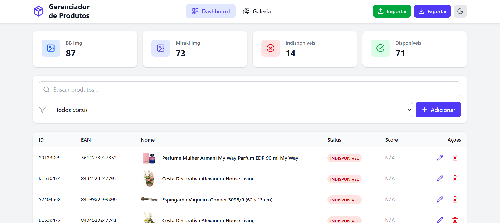
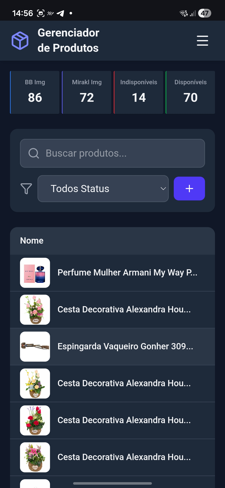

# 📦 Sistema de Gerenciamento de Produtos

Sistema web moderno para gerenciamento e visualização de produtos com suporte a modo claro/escuro, importação de Excel, e interface responsiva.

## 🚀 Tecnologias Usadas

### Core

- **Vue 3** (v3.5.24)
- **TypeScript** (v5.9.3)
- **Vite** (v7.2.4)

### Estado e Roteamento

- **Vue Router** (v5.0.2)
- **Pinia** (v3.0.4)
- **Pinia Plugin Persistedstate** (v4.7.1)

### UI e Estilização

- **Tailwind CSS** (v4.1.18)
- **Lucide Vue Next** (v0.563.0)

### Utilitários

- **ExcelJS** (v4.4.0)
- **PostCSS** e **Autoprefixer**

## ✨ Funcionalidades

- **Visualização de Métricas**: Cards com estatísticas de produtos (BB Img, Mirakl Img, Disponíveis/Indisponíveis)
- **Tabela Interativa**:
  - Ordenação por colunas (ID, EAN, Nome, Status, Score)
  - Paginação (15 itens por página)
  - Filtro de busca
  - Edição e exclusão de produtos
- **Gerenciamento de Produtos**:
  - CRUD deprodutos via modal
- **Importação/Exportação Excel**:
  - Importar e Exportar produtos de planilhas Excel
- **Pagina de Detalhes**:
  - Informações Completas sobre produto

### 🎨 Interface

- **Modo Claro/Escuro**: Alternância com persistência
- **Totalmente Responsivo**: Mobile-first design
- **Animações Suaves**: Transições e hover effects

### 🔧 Recursos Técnicos

- **Persistência de Dados**: Produtos salvos automaticamente

## 📦 Como Instalar e Iniciar

### Pré-requisitos

- **Node.js** (versão 18 ou superior)
- **npm**
- **Git**

### Instalação e Iniciação

```bash
# 1. Clone o repositório
git clone <url-do-repositorio>

# 2. Entre na pasta do projeto
cd teste-frontend

# 3. Instale as dependências
npm install

# 4. Inicie o servidor de desenvolvimento
npm run dev

# 5. Acesse no navegador
http://localhost:5173
```

## 📁 Estrutura de Pastas

```

src/
   ├── assets/               # Imagens, fontes e outros assets
   ├── components/           # Componentes Vue
   │   ├── features/         # Componentes específicos de features
   │   │   ├── dashboard/    # Componentes do Dashboard
   │   │   ├── gallery/      # Componentes da Galeria
   │   │   ├── layout/       # Componentes de layout
   │   │   └── productDetails/ # Componentes de detalhes
   │   └── ui/               # Componentes UI reutilizáveis
   │
   ├── composables/          # Lógica reutilizável
   │
   ├── router/               # Configuração de rotas
   │
   ├── services/             # Serviços externos
   │
   ├── stores/               # Stores Pinia
   │
   ├── types/                # Definições TypeScript
   │
   └── views/                # Páginas/Views

```

## 💬 Comentários

- **Escolha da Stack**: Escolhido o vue3 como forma de me desafiar, uma vez que venho primariamente do React/Next. Foi utilizada uma arquitetura minimalista com componentes que imitam o shadcn (construídos com Tailwind CSS a partir do código).

- **Resultado**: Acredito que foi entregue um aplicativo funcional, responsivo, que atende aos requisitos levantados e adiciona melhoras significativas à proposta.

## 📸 Screenshots

<div align="center">
  
  
</div>

---

**Desenvolvido com Vue 3 + TypeScript + Tailwind CSS**


